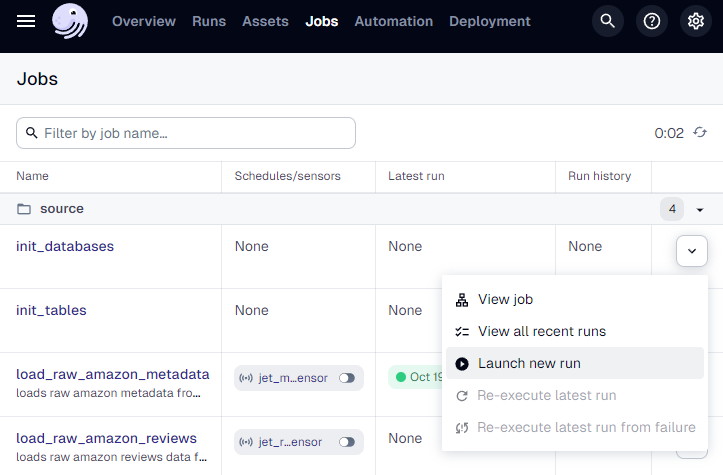
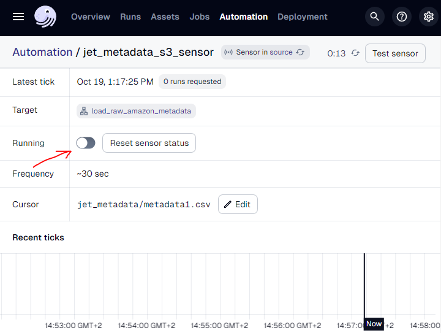
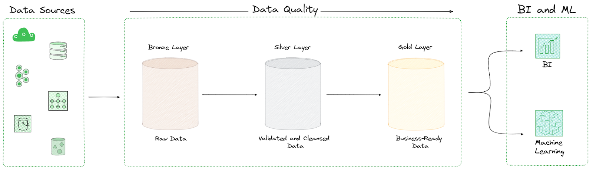
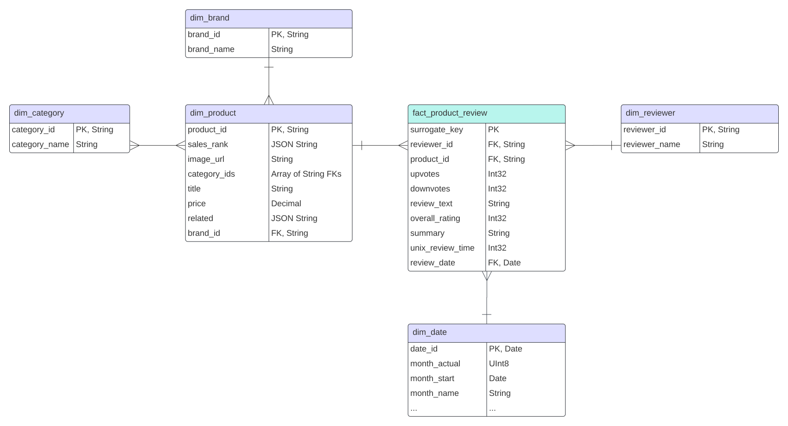

# Take-home Assignment
For the Data Warehouse Engineer role at [Just Eat Takeaway](https://www.justeattakeaway.com/)

Estimated effort:
  - 1 day to learn Dagster and ClickHouse from scratch
  - 1 day to develop the solution

## Setup
  - Install Python, Docker, VSCode (or any other IDE of your taste)
  - Make a copy of the [`.env.example`](.env.example) file and rename it to `.env`
  - Replace the `replace` values with the correct values
  - Run the following commands:

    ```bash
    make infra-up
    make check-clickhouse
    make setup
    ```

    - This will:
      - Set up Docker infrastructure (Dagster and webserver, ClickHouse DWH, and Keeper)
      - Check connectivity to ClickHouse
      - Create a Python virtual environment
      - Install python dependencies and dbt packages
      - Export the environment variables
  - Open [`Dagster jobs web UI`](http://127.0.0.1:3000/jobs) and run
    - `init_databases` job to create `raw_thirdparty` and `dwh_dev` databases
    - `init_tables` job to create raw tables for Amazon reviews and metadata

    

  - Enable `jet_metadata_s3_sensor` and `jet_reviews_s3_sensor` sensors to start the pipelines

      

  - Finally, upload the CSV files into the corresponding S3 bucket folders (`jet_reviews`, `jet_metadata`) to trigger the pipelines

## Artifacts
  - Exploratory data analysis: Python Notebooks, DuckDB
  - DWH Model (ER Diagram), see below
  - Dagster pipeline lineage, see below
  - AWS: Data lake setup
  - Docker containerized
    - ClickHouse: Central columnar data warehouse (DWH)
    - Dagster: Orchestration, data pipelines, dbt runner, and data lineage
    - dbt: Medallion-layered DWH schema with a Star schema atop, data quality enforcement, and SQL transformations
  - Miscellaneous: GitHub, Docker, flake8, SQLFluff, pre-commit, makefile

## Development stages
The following steps outline the solution development process:

1. 👨‍🔧 Performed Exploratory Data Analysis (EDA)

    Using Python Notebooks and DuckDB, a sample data analysis was conducted. This can be viewed in [analysis/exploratory_analysis.ipynb](analysis/exploratory_analysis.ipynb).
EDA helps to understand the data and identify potential challenges for the subsequent steps. Notebooks are a convenient way to perform quick analyses, understand the data structure, and plot graphs for visual insights.

2. 👨‍🔧 Built Data Lake on AWS S3

    All raw data from Amazon is meant to go on S3 first via CSV files for the following processing using Dagster.

    IAM and data retention with using hot/cold storage are set up to achieve maximum security, speed, and economy.

3. 👨‍🔧 Built ClickHouse DWH

    As per the assignment's preference for open-source tools, [ClickHouse](https://clickhouse.com/) was used as the main DWH, utilizing the [MergeTree](https://clickhouse.com/docs/en/engines/table-engines/mergetree-family/mergetree) table engine.

    ClickHouse is known for its real-time performance and resource efficiency.

4. 👨‍🔧 Built Dagster Batch Data Loading and Cleansing Pipeline (bronze/silver layers)

    A pipeline was developed to load raw data from S3 into ClickHouse. Key features include:
    - Connection to S3
    - Sensors to detect new CSV files in the source bucket (polling every 30    - seconds)
    - INSERTs into ClickHouse using its native S3 -> ClickHouse connector
    - Metadata columns (_meta) added for tracking, logging, and debugging.

    

    Dagster partitions the files, and ClickHouse efficiently parses the schema and inserts records into the raw data database.

    

    Data cleansing is handled through dbt staging layer models, following the medallion architecture for progressive data quality improvements.

    To achieve better team coordination and project usability, Dagster module is ready to be built using docker-compose for local environments via prepared shell scripts (see above). For production, it can be deployed on Kubernetes (EKS, GKE, AKS) using the included docker file or pre-generated docker-image.

5. 👨‍🔧 Built Kimball (Snowflake) Dimensional dbt Schema (gold layer)

    A snowflake schema was developed for the following main entities:
      - [mrt_fact_product_review](dbt/models/mart/amazon/mrt_fact_product_review/mrt_fact_product_review.sql): Central fact table with product reviews
      - [mrt_dim_date](dbt/models/mart/common/mrt_dim_date/mrt_dim_date.sql): Date dimension for reporting
      - [mrt_dim_reviewer](dbt/models/mart/amazon/mrt_dim_reviewer/mrt_dim_reviewer.sql): Reviewer dimension
      - [mrt_dim_product](dbt/models/mart/amazon/mrt_dim_product/mrt_dim_product.sql): Product dimension
      - [mrt_dim_brand](dbt/models/mart/amazon/mrt_dim_brand/mrt_dim_brand.sql): Product brand dimension
      - [mrt_dim_category](dbt/models/mart/amazon/mrt_dim_category/mrt_dim_category.sql): Product category dimension

      

6. 👨‍🔧 Built dbt Analytics Models

    The next models were built to analyze Amazon reviews:
    - [mrt_analytics_brand_ratings](dbt/models/mart/analytics/mrt_analytics_brand_ratings/mrt_analytics_brand_ratings.sql): Review ratings per brand, per month
    - [mrt_analytics_category_ratings](dbt/models/mart/analytics/mrt_analytics_category_ratings/mrt_analytics_category_ratings.sql): Review ratings per category, per month

7. 👨‍🔧 Added dbt Data Quality Checks, Tests, and Exposures

    About 60 `dbt/dbt_utils` tests were added, including tests for uniqueness, nullability, and acceptable ranges.

    dbt exposures and schema contract enforcement were applied to analytics models to ensure data consumers' expectations were met.

8. 👨‍🔧 Deployed and Tested the Solution

    The entire solution was deployed using Docker, with S3 and ClickHouse initialization operations completed.

    The Dagster pipeline was tested with the `category_clothing_shoes_and_jewelry` dataset, and the schema was generated via dbt.

9. 👨‍🔧 Generated Assignment Artifacts

    ER diagram, dbt static docs, and Dagster lineage are available in `/artifacts`

## Improvements and TODOs
  Several non-critical issues and potential improvements were identified, including:

  - Dagster partitions are not fully integrated with dbt, preventing automatic end-to-end pipeline completion.
  - dbt freshness tests require additional configuration in Dagster.
  - SQLFluff for ClickHouse needs further attention for accurate linting.
  - A small number of CSV parsing errors are currently allowed for simplicity; this can be adjusted to ensure all rows are processed.
  - The solution is not optimized for large-scale datasets.
    - However, on a ~10-year-old CPU with 2 GB memory available for Docker Dagster instance, the data pipeline and dbt full refresh takes less than one minute with the majority of time spent on networking from S3.
    - Thus, the current solution allows to process 10x bigger data volume several times a day, as per the `good to have` assignment instructions.

Performance improvements for larger datasets/more frequent loads include:
  - CSV compression to reduce networking and storage costs.
  - Date partitioning in S3 and leveraging ClickHouse’s parallel loading.
  - Consideration of alternative ClickHouse table engines for specific use  cases.
  - Fine-tuning container resource allocations.
  - Scaling ClickHouse with a multi-cluster deployment.

## Out-of-scope Features

  Possible enhancements for future releases:

  - Dagster/ClickHouse:
    - Notification integration (Slack, Teams, etc.).
    - Authentication and authorization (SSO, MFA).
    - Comprehensive pipeline testing (unit, integration, smoke, performance).
    - Advanced data observability and quality enforcement (Monte Carlo,     - Elementary, Great Expectations).
    - Regular backups.
  - Infrastructure
    - CI/CD integration (e.g., GitHub Actions), [Slim CI](https://medium.com/@thiernomadiariou/slim-ci-with-dbt-core-and-snowpark-ffbb80b81fec).
    - IaC, deployment scalability using Kubernetes (EKS, GKE, AKS, Terraform).
    - Logging with the [ELK](https://logz.io/learn/complete-guide-elk-stack/) stack.
    - Storage improvements (compression, cold storage).
    - Monitoring and notifications (Prometheus or AWS-native tools).
    - Fault tolerance via multi-zone/multi-region deployment.
    - Other security (Vault, AWS-native vaults, and key storage)
  - Datawarehousing
    - Role-based access control (DBT, AWS IAM, Terraform).
    - Data management standards ([ISO 8000](https://www.iso.org/standard/81745.html)/[DAMA-DMBOK](https://www.dama.org/cpages/home)/DCAM/LEAN).
    - Compliance policies (GDPR, CCPA).
  - Hosting dbt docs and project documentation (e.g. Confluence)
  - Integration with BI tools (PowerBI, QuickSight, Tableau)
  - End-of-life support
